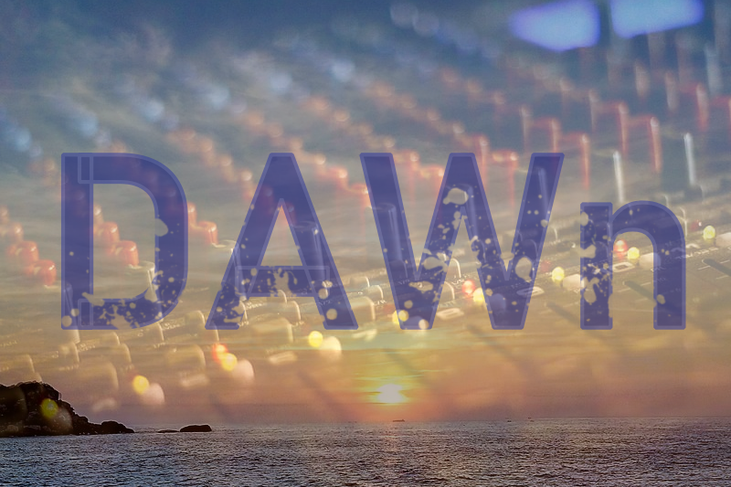
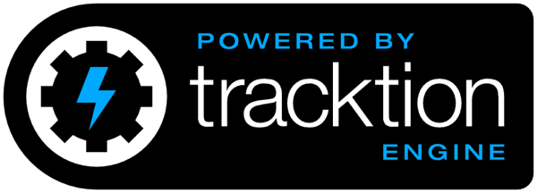

# DAWn
DAWn stands for Digital Audio Workstation Nextgen.

This ambitious project is an attempt to learn about digital audio workstation development with a concrete motivation.

It does not do much that you can really use yet, 
so if you'd like to use a great already developed DAW that reuses the tracktion_engine and that is currently released, check this out:
https://www.tracktion.com/products/waveform-pro

A lot of thanks go to Julian, Dave and Roland for making tracktion_engine available to us as well as the great underlying JUCE framework!
https://github.com/Tracktion/tracktion_engine
https://juce.com/

